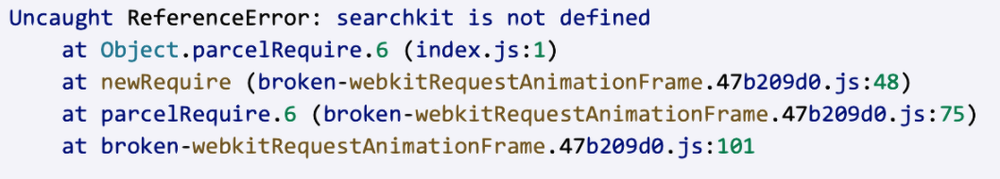

*Question 1*  

 
From: marissa@startup.com  
Subject:  Bad design  

Hello,  
  
Sorry to give you the kind of feedback that I know you do not want to hear, but I really hate the new dashboard design. Clearing and deleting indexes are now several clicks away. I am needing to use these features while iterating, so this is inconvenient.  
   
Thanks,  
Marissa  

------------------------------

From: joshua.zuill@algolia.com  
Subject:  Bad design  

Hi Marissa,

Firstly, thank you for your feedback. Feedback from users such as yourself helps us understand where the dashboard needs to improve.

I’m sorry the additional clicks are making clearing and deleting indexes inconvenient while you are iterating.

For a workflow where you regularly repeat these actions, one option is to use Algolia’s API to include them in your development script. Clearing removes the records whilst retaining the settings, synonyms and rules; deleting removes the index itself. This could reduce the need to repeat the dashboard steps and I would be happy to step you through setting this up.

If helpful, I would be happy to have a short meeting to review your workflow and discuss whether this approach would suit you. It would also allow me to gather your click-path and suggestions and share these with our product team.

Please let me know if you would like to arrange a quick call.

Kindest regards,

Joshua Zuill

--

*Question 2*:   
  
From: carrie@coffee.com  
Subject: URGENT ISSUE WITH PRODUCTION!!!!  
  
Since today 9:15am we have been seeing a lot of errors on our website. Multiple users have reported that they were unable to publish their feedbacks and that an alert box with "Record is too big, please contact enterprise@algolia.com".  
  
Our website is an imdb like website where users can post reviews of coffee shops online. Along with that we enrich every record with a lot of metadata that is not for search. I am already a paying customer of your service, what else do you need to make your search work?  
  
Please advise on how to fix this. Thanks.   

------------------------------

From: joshua.zuill@algolia.com  
Subject: URGENT ISSUE WITH PRODUCTION!!!!

Hi Carrie,

I’m sorry your users are unable to publish their feedback. As this is affecting production, I would consider this urgent and prioritise investigating it.

The error you are seeing means a record being sent to Algolia for indexing exceeds your plan’s record-size limit. The additional metadata may be contributing to this, particularly if each coffee shop record contains a growing collection of reviews.

Being a paying customer does not necessarily mean you need to upgrade. I would first check your plan’s limit and the size of a rejected record. Algolia’s current Standard, Premium and Grow plans allow individual records up to 100 KB, with a 10 KB average limit.

For immediate investigation, could you please share your application ID, index name and an example of a rejected record, with any personal information or credentials removed? Please also confirm the timezone for the 9:15am start time and any changes made around then.

In parallel, I suggest we jump into a quick call. If you could spare me 30 minutes, I would propose the following agenda:

- A short overview of the problem demonstrated by yourself.
- A quick review of your index and the failed indexing request.
- A review of the rejected record and its size.
- Suggestions to reduce the metadata whilst retaining what is needed for searching, filtering, ranking and displaying results.

The immediate approach I would explore is removing unnecessary metadata from the records sent to Algolia, whilst keeping the full information in your database. Any additional detail could then be retrieved once the user selects a result. This aligns with Algolia’s guidance on reducing record sizes.

Once the payload is within the applicable limit, we can retry the failed indexing operation and confirm that publishing feedback works again. We should also check whether the feedback was saved in your database before indexing failed, to avoid duplicate submissions.

I can help coordinate the investigation with Support and keep our findings together in the ticket. Please let me know your availability today; we can begin reviewing the details above in the meantime.

Kindest regards,

Joshua Zuill

--

*Question 3*:   

From: marc@hotmail.com  
Subject: Error on website  
  
Hi, my website is not working and here's the error:  
  
  
  
Can you fix it please?  

------------------------------

From: joshua.zuill@algolia.com  
Subject: Error on website  

Hi Marc,

Thanks for reaching out and providing that error message. Could you please confirm which search library your website uses and how Algolia is included in your setup? The screenshot references searchkit, but I would need to see the code to establish what that name refers to.

The error means your JavaScript is trying to use searchkit, but that name is not available when the code runs.

Before I can identify the cause, I’ll need some more information. Could you please provide the following:

The affected website link and any steps I might need to follow to trigger this error.

The code around the searchkit reference in index.js, including any related imports or script tags.

Any recent changes you might have made to the code or website.

Please leave out any API keys or other credentials.

I would also be really happy to hop onto a quick call and gather this information together. Please let me know your availability if that would be easier.

With those details, I can review the issue and advise on the next steps.

Kindest regards,

Joshua Zuill